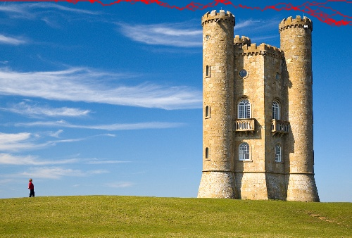
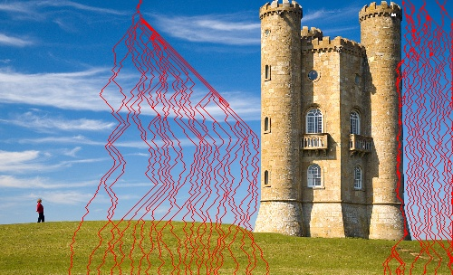
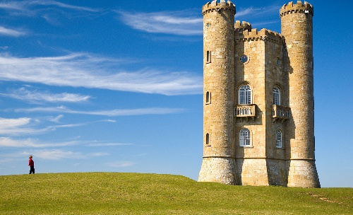
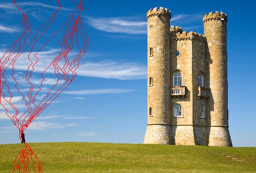
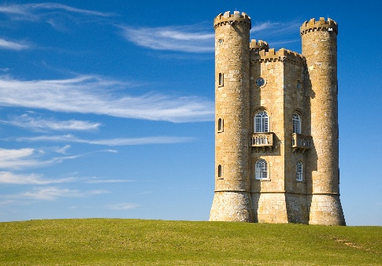
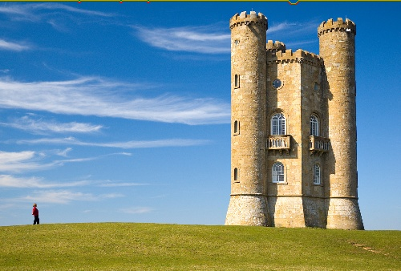
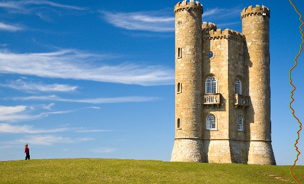

# SEAM-CARVING
<table>
<tr>
<td>
The goal of this assignment is to do seam carving of images and extends to object carving. Seam carving is a method of re-sizing an image and resizing of an image will be implemented on the basis of method described in the paper by Avidan and Shamir.
</td>
</tr>
</table>

## Execution Way
We have implemented all the required functions and asked user to select one of them
- Option 1 for normal seam carving.
- Option 2 for Object removal
- Option 3 for seam carving using Guassian Pyramid.

>>python seam_carving.py image_name

Now enter 1 for normal seam carving, 2 for object removal and 3 for seam seam carving using Gaussian Pyramid.

## Procedure
- Create energy map for horizontal and vertical seam separately. The main idea behind resizing is to identify seam connecting from top to bottom (for vertical seam) and left to right (for horizontal seam) pixels with minimum energy. For finding minimum energy we are using dynamic programming approach.
- Create seam horizontal wise from left to right pixels with minimum energy.
- Create seam vertically from top to bottom pixels with minimum energy.
- First remove horizontal seam and show the resultant image.
- Remove vertical seam and show the resultant image. Backtracking from bottom to the top edge of the accumulated cost matrix to find the minimum seam. All the pixels in each row after the pixel to be removed are shifted over one column to the left if it has index greater than the minimum seam.

## Seam Created
We are creating seams using Sobel Operator-based derivative by applying dynamic programming for finding seam with minimum energy among all and it is giving result as following for horizontal and vertical seams:

## Seam Removal
After finding seams they have been removed from the images one by one

## Time of Execution for removing 100 vertical and 168 horizontal seams
31.091285228729248

## Object Removal
### Procedure:
- We are giving control to user that which object user wants to remove.
- User will create the points around the object which user wants to remove by left clicking on image when finished click right.
- Then mask will be created for that specific object.
- As a result, that object will be remove from that image. When generating energy map, the region covered by mask are weighted with a very low negative value. This guarantees that the minimum seam will be routed through the masked region. Seam removal is performed repeatedly until masked region has been completely removed as stated above with one more step. Outputs of the intermediate steps and final steps has been shown below

   

## Time of Execution for removing man in the image 
4.416746377944946

## Seam Removal using Gaussian Pyramid
Gaussian Pyramid is method through which performance of the seam carving can be improved significantly. Here, we are using only one pyramid layer for seam carving this can be extend to more layers as well very easily by making a few modifications.
### Steps:
- First, we generated a pyramid layer which has half of the dimensions of the original image.
- We calculated the seam of this pyramid layer and used this to map the seams to the original image.
- We removed the seams from the pyramid layer as well as original in loop. Two seams were removed from original image corresponding to the one seam in pyramid layer.
- Repeatedly performed this until we removed the required seams in original image. The outputs of the intermediate step are shown below and output of the final step is same as normal seam carving. The two seams are shown by different colors (Green, Red).

## Time of Execution for removing 100 vertical and 168 horizontal seam
5.496361017227173

## Observation
Seam removal using Gussian Pyramid is 6 times faster the normal seam carving by using just one pyramid layer.
